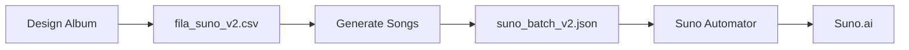

# Maestro AI - Neural Audio Workstation

> **Desconstruir e reconstruir música complexa (Metal/Jazz/IDM) unindo estabilidade nativa com IA generativa local.**

## 🎯 Visão Geral

Maestro AI é um sistema de geração de álbuns e músicas baseado em arquétipos da cultura pop, utilizando LLMs locais (Ollama) para criar prompts de estilo e letras para a plataforma Suno.

## 🚀 Quick Start

### Pré-requisitos

* Python 3.8+
* Docker & Docker Compose (para Ollama)
* GPU NVIDIA (opcional, mas recomendado)

### Instalação

```bash
# Clone o repositório
git clone <repo-url>
cd maestro_prompt

# Crie ambiente virtual
python -m venv venv
source venv/bin/activate  # Windows: venv\Scripts\activate

# Instale dependências
pip install -r requirements.txt

# Inicie o Ollama via Docker
docker-compose up -d

# Baixe o modelo (primeira vez)
docker exec -it maestro_ollama ollama pull mistral-nemo:12b
```

### Uso - Console App

```bash
python maestro_cli.py
```

**Menu Interativo:**

1. 🎨 Design New Album
2. 🎵 Generate Songs from Queue
3. 📊 View Queue Status
4. 📦 Export to Suno JSON
5. 🚪 Exit

### Uso - Script Direto

```bash
# Desenhar um álbum
python maestro_ollama_enhanced.py --mode albums --archetype cosmic_horror --tracks 8 --title "Abyssal Resonance"

# Gerar músicas da fila
python maestro_ollama_enhanced.py --mode songs --csv fila_suno_v2.csv
```

## 📂 Estrutura do Projeto

```
maestro_prompt/
├── data/                          # Base de conhecimento (JSON)
│   ├── aesthetics_semiotics.json  # 60+ arquétipos da cultura pop
│   ├── genre_fusion_matrix.json   # Receitas de fusão de gêneros
│   ├── scales_emotions.json       # Mapeamento escala-emoção
│   └── ...
├── docs/                          # Documentação
│   ├── CONSOLE_APP_GUIDE.md       # Guia do console app
│   ├── FLASK_WEB_APP_ROADMAP.md   # Roadmap para web app
│   └── MAESTRO_IMPROVEMENTS_REPORT.md
├── lyrics/                        # Letras exportadas (Markdown)
├── maestro_cli.py                 # 🆕 Console App Interativo
├── maestro_ollama_enhanced.py     # Core do sistema
├── maestro_brave_automator.py     # Automação Suno (Brave)
├── fila_suno_v2.csv              # 🆕 Fila centralizada
├── docker-compose.yml             # 🆕 Ollama via Docker
└── requirements.txt
```

## 🎨 Arquétipos Disponíveis

* **Sci-Fi**: `cosmic_horror`, `cyberpunk_noir`, `post_apocalyptic_wasteland`
* **Fantasy**: `dark_fantasy`, `mythological_epic`, `folklore_forest`
* **Horror**: `occult_ritual`, `haunted_asylum`, `demonic_possession`
* **Action**: `heist_precision`, `gladiator_arena`, `revenge_western`
* **Drama**: `film_noir_femme_fatale`, `courtroom_drama`, `college_coming_of_age`

[Ver lista completa](data/aesthetics_semiotics.json)

## 🐳 Docker Setup

### Iniciar Ollama

```bash
docker-compose up -d
```

### Verificar Status

```bash
docker ps
curl http://localhost:11434/api/tags
```

### Parar Ollama

```bash
docker-compose down
```

## 🔧 Configuração

### Modelo LLM

Edite `maestro_ollama_enhanced.py`:

```python
MODEL_NAME = "mistral-nemo:12b"  # ou "llama3:8b", "mixtral:8x7b"
```

### Timeouts

```python
# Album design (linha 445)
timeout=300

# Song generation (linha 638)
timeout=300
```

## 📊 Fluxo de Trabalho



## 🎵 Exemplo de Saída

### CSV (fila_suno_v2.csv)

```csv
album,titulo,tema,genero,mood,estetica,status,processada,observacoes
Echoes from the Chasm,Stellar Whispers,First signals from unknown,Dark Ambient,Anticipation,cosmic_horror,pending,nao,Narrative: Astronomer's descent into madness
```

### JSON (suno_batch_v2.json)

```json
{
  "id": 1,
  "album": "Echoes from the Chasm",
  "title": "Stellar Whispers",
  "style_prompt": "[Is_MAX_MODE: MAX](MAX)\nDark Ambient, Drone Synth, Lo-Fi Drum Machine",
  "lyrics": "[Intro]\nIn the silent hum of cosmic winds..."
}
```

## 🚀 Roadmap

### ✅ Concluído

- [x] Sistema de arquétipos semióticos
* [x] Geração de álbuns via LLM
* [x] CSV centralizado com deduplicação
* [x] Docker Compose para Ollama
* [x] Console App interativo

### 🔄 Em Progresso

- [ ] Flask REST API
* [ ] Frontend React
* [ ] Autenticação de usuários

### 📋 Planejado

- [ ] Integração direta com Suno API
* [ ] Sistema de templates de prompts
* [ ] Analytics dashboard

[Ver roadmap completo](docs/FLASK_WEB_APP_ROADMAP.md)

## 🤝 Contribuindo

1. Fork o projeto
2. Crie uma branch (`git checkout -b feature/nova-feature`)
3. Commit suas mudanças (`git commit -m 'Add nova feature'`)
4. Push para a branch (`git push origin feature/nova-feature`)
5. Abra um Pull Request

## 📝 Licença

Este projeto está sob a licença MIT.

## 🙏 Agradecimentos

* **Ollama** - LLM local inference
* **Suno.ai** - Geração de música
* **Mistral AI** - Modelo Mistral-Nemo

---

**Desenvolvido com ❤️ para músicos e criadores**
