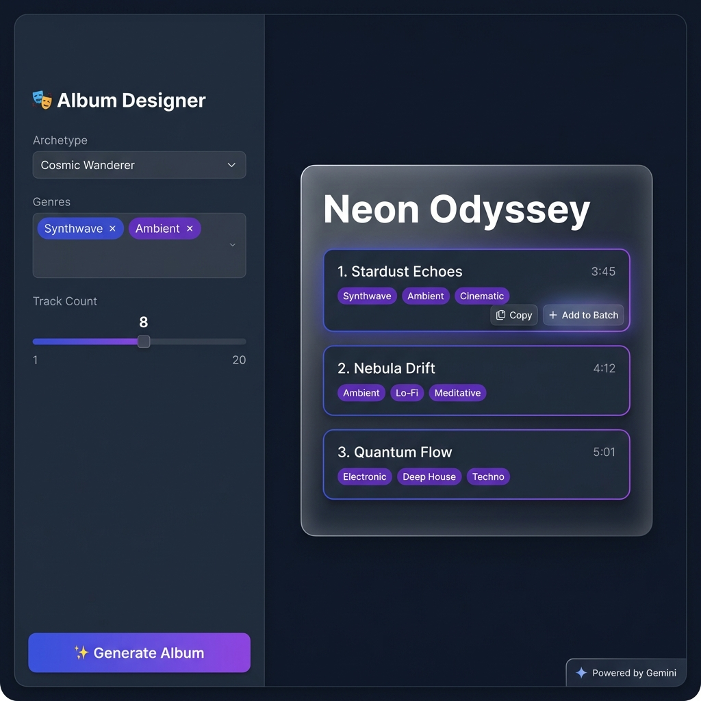
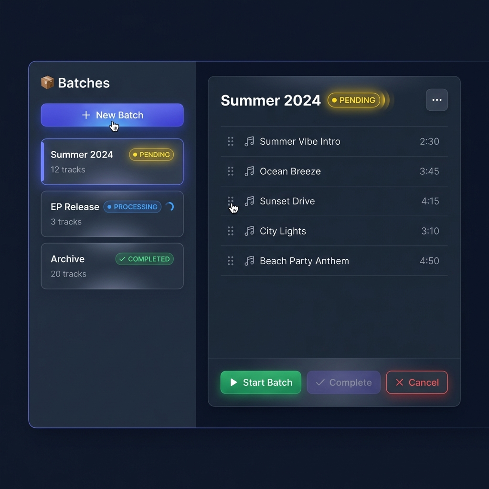

# UI/UX Design Specifications - Maestro AI

## Design System

### Color Palette (Dark Mode)

**Primary Colors:**

- Primary: `#6366f1` (Indigo) - Creative energy
- Secondary: `#8b5cf6` (Purple) - Musical innovation
- Accent: `#ec4899` (Pink) - AI-powered magic

**Status Colors:**

- Success: `#10b981` (Green)
- Warning: `#f59e0b` (Amber)
- Error: `#ef4444` (Red)

**Background:**

- Background: `#0f172a` (Slate 900)
- Surface: `#1e293b` (Slate 800)
- Text: `#f1f5f9` (Slate 100)

### Typography

- **Headings:** Inter (bold, 600-700 weight)
- **Body:** Inter (regular, 400-500 weight)
- **Code/Mono:** Fira Code

---

## Design 1: Album Designer

### Layout Specifications

#### LEFT PANEL (30% width)

**Background:** Dark slate `#1e293b`

**Header:**

- Text: "🎭 Album Designer"
- Font: Inter, white color
- Size: 24px, bold

**Input Section:**

1. **Archetype Dropdown**
   - Label: "Archetype" (light gray, 14px)
   - Example value: "Cosmic Wanderer"
   - Style: Dark background, white text
   - Border: Subtle gray outline
   - Height: 40px

2. **Genres Multi-Select**
   - Label: "Genres" (light gray, 14px)
   - Chips: "Synthwave", "Ambient"
   - Chip colors: Indigo/purple background
   - Chip style: Rounded, removable (× icon)
   - Allow multiple selection

3. **Track Count Slider**
   - Label: "Track Count" (light gray, 14px)
   - Current value: "8" (centered, white, 18px)
   - Range: 1-20
   - Track color: Indigo gradient
   - Thumb: White circle with shadow

**Generate Button:**

- Text: "✨ Generate Album"
- Style: Large gradient button (indigo to purple)
- Position: Bottom of panel
- Height: 48px
- Border radius: 8px
- Hover: Slight scale (1.02) + glow effect

#### RIGHT PANEL (70% width)

**Background:** Darker slate `#0f172a`

**Album Card:**

- Background: Glass morphism effect
  - Backdrop blur: 12px
  - Border: 1px solid rgba(255,255,255,0.1)
  - Border radius: 12px
  - Shadow: 0 8px 32px rgba(0,0,0,0.3)

**Album Title:**

- Text: "Neon Odyssey"
- Font: Inter, bold, white
- Size: 32px
- Margin bottom: 24px

**Track Cards (3 visible):**

- **Layout:** Stacked vertically, 16px gap
- **Background:** Dark with subtle border glow
  - Color: rgba(30, 41, 59, 0.8)
  - Border: 1px solid rgba(99, 102, 241, 0.3)
  - Border radius: 8px
  - Padding: 16px

- **Track Number + Title:**
  - Color: White
  - Font: 16px, medium weight
  - Format: "1. Stardust Echoes"

- **Style Tags:**
  - Small purple badges
  - Background: rgba(139, 92, 246, 0.2)
  - Border: 1px solid #8b5cf6
  - Padding: 4px 8px
  - Border radius: 4px
  - Font: 12px

- **Duration:**
  - Color: Gray (#94a3b8)
  - Font: 14px
  - Align: Right

- **Hover State:**
  - Mini buttons appear: "Copy" and "Add to Batch"
  - Scale: 1.02
  - Border glow: Brighter indigo

**Footer:**

- Badge: "Powered by Gemini"
- Position: Bottom right
- Size: Small (10px font)
- Color: Gray

---

## Design 2: Batch Manager

### Layout Specifications

#### LEFT SIDEBAR (35% width)

**Background:** Dark slate `#1e293b`

**Header:**

- Text: "📦 Batches"
- Font: Inter, white, 24px bold

**New Batch Button:**

- Text: "+ New Batch"
- Style: Indigo gradient
- Width: 100%
- Height: 40px
- Border radius: 8px
- Margin bottom: 16px

**Batch Cards (List of 3):**

Each card:

- **Background:** rgba(15, 23, 42, 0.6)
- **Border:** 1px solid rgba(255,255,255,0.1)
- **Padding:** 12px
- **Border radius:** 8px
- **Margin bottom:** 8px

Card content:

1. **Title** (e.g., "Summer 2024")
   - Font: 16px, medium weight, white

2. **Status Badge:**
   - PENDING: `● PENDING` (yellow `#f59e0b`)
   - PROCESSING: `● PROCESSING` (blue `#3b82f6`, spinner animation)
   - COMPLETED: `✓ COMPLETED` (green `#10b981`)
   - Font: 12px, inline with title

3. **Track Count:**
   - Text: "12 tracks" (gray `#94a3b8`, 14px)
   - Position: Below title

**Hover Effect:**

- Subtle glow: 0 0 12px rgba(99, 102, 241, 0.3)
- Cursor: pointer

**Active Selection:**

- Left border: 3px solid indigo `#6366f1`
- Background: Slightly lighter

#### RIGHT PANEL (65% width)

**Background:** Darker slate `#0f172a`

**Batch Detail Header:**

- **Title:** "Summer 2024"
  - Font: 28px, bold, white
  
- **Status Badge:** "● PENDING"
  - Yellow color with pulse animation
  - Animation: opacity 0.5 → 1.0, 2s infinite
  
- **Actions Menu:**
  - Icon: Three dots (vertical)
  - Position: Top right
  - Opens: Dropdown menu (Export JSON, Delete)

**Track List (4-5 items):**

Each track row:

- **Height:** 48px
- **Padding:** 12px
- **Border bottom:** 1px solid rgba(255,255,255,0.05)

Row content:

1. **Drag Handle:**
   - Icon: Six dots (vertical)
   - Color: Gray
   - Position: Left (8px from edge)

2. **Music Icon:** 🎵
   - Position: 32px from left

3. **Track Title:**
   - Font: 14px, white
   - Position: 60px from left

4. **Duration:**
   - Font: 14px, gray
   - Position: Right aligned

**Bottom Action Bar:**

Three buttons:

1. **"▶ Start Batch"** (Green)
   - Background: `#10b981`
   - Text: White
   - Height: 40px
   - Border radius: 6px

2. **"✓ Complete"** (Purple, disabled)
   - Background: rgba(139, 92, 246, 0.3)
   - Text: Gray
   - Cursor: not-allowed

3. **"✕ Cancel"** (Red outline)
   - Background: Transparent
   - Border: 1px solid `#ef4444`
   - Text: Red

Button spacing: 12px gap between each

---

## Design Principles

1. **Glass Morphism:**
   - Backdrop blur on cards
   - Semi-transparent backgrounds
   - Subtle border highlights

2. **Smooth Gradients:**
   - Primary CTAs use indigo-to-purple
   - Hover states amplify gradients

3. **Status Indicators:**
   - Color-coded badges
   - Animated states (pulse, spinner)
   - Clear visual hierarchy

4. **Micro-interactions:**
   - Hover scale (1.02)
   - Glow effects on focus
   - Smooth transitions (200-300ms)

5. **Accessibility:**
   - High contrast ratios (>4.5:1)
   - Clear focus indicators
   - Keyboard navigable

---

## Component Library Reference

**Shared Components:**

- `<Card />` - Glass morphism container
- `<Button />` - Primary, secondary, ghost variants
- `<Badge />` - Status indicators
- `<Select />` - Dropdown with Radix
- `<MultiSelect />` - Checkbox genre picker
- `<Slider />` - Range input
- `<Modal />` - Overlay dialogs

**Animations:**

- Framer Motion for smooth transitions
- Stagger animations on lists
- Pulse/spinner for loading states

---

**Last Updated:** 2026-02-01  
**Design Tool:** AI Generated (Imagen 3)  
**Target Frameworks:** React + TailwindCSS v4 + Radix UI
